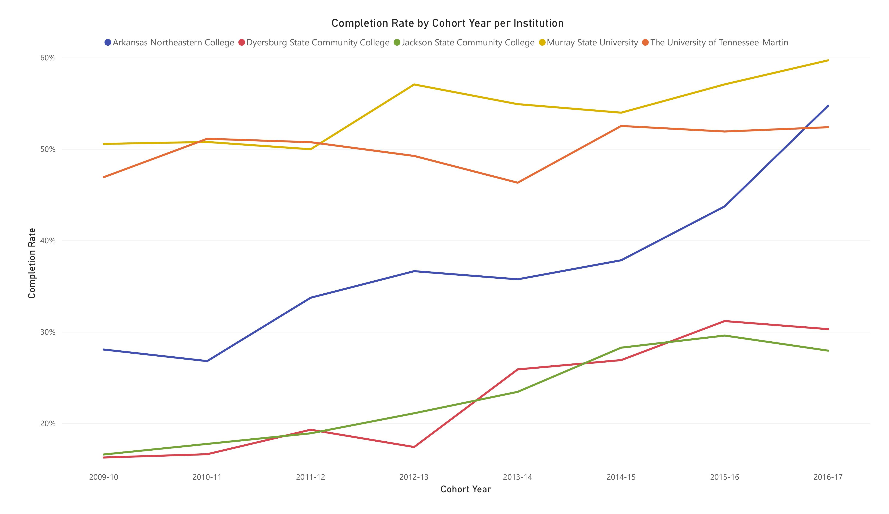
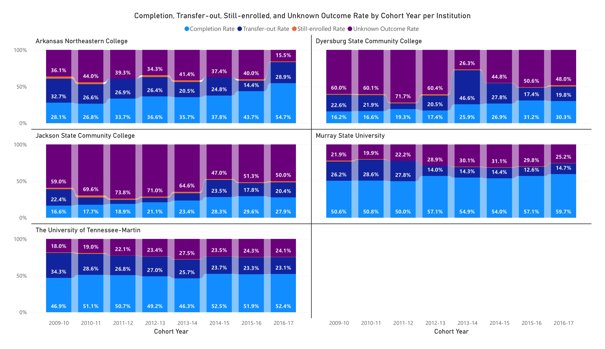
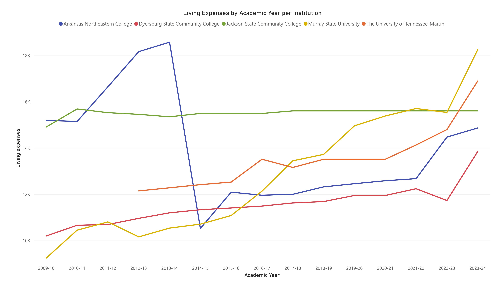

## Abstract

This analysis attempts to organize and visualize the outcome of eight cohorts across five different institutions, as well as attempting to correlate the completion rate of each cohort with the institution-reported living expenses. The data did not provide a meaningful correlation between the institution-reported living expenses and the completion rate of cohorts.

---

## Questions

1. Among UT Martin and four nearby institutions, what is the outcome of entering first-time, full-time freshmen? How has it changed over time?
2. Is there a relationship between the institution-reported living expenses and the completion rate?

## Institutions

| Institution | UNITID | Sector | Location |
|---|---|---|---|
| The University of Tennessee-Martin (UTM) | 221768 | 4-year public | Martin, TN |
| Murray State University (MSU) | 157401 | 4-year public | Murray, KY |
| Dyersburg State Community College (DSCC) | 220057 | 2-year public | Dyersburg, TN |
| Jackson State Community College (JSCC) | 220400 | 2-year public | Jackson, TN |
| Arkansas Northeastern College (ANC) | 107327 | 2-year public | Blytheville, AR |

---

## Question 1: Cohort Outcomes

### The Oldest Cohort

The oldest cohort in the dataset enrolled between July 1, 2009 and June 30, 2010, with their status recorded August 31, 2017.

| Institution | Cohort | Completed | Transferred out | Still enrolled | Outcome unknown |
|---|---:|---:|---:|---:|---:|
| Murray State | XXX | XXX | XXX | XXX | XXX |
| UT Martin | XXX | XXX | XXX | XXX | XXX |
| Arkansas Northeastern | XXX | XXX | XXX | XXX | XXX |
| Dyersburg State | XXX | XXX | XXX | XXX | XXX |
| Jackson State | XXX | XXX | XXX | XXX | XXX |

### The Latest Cohort

Students entering between July 1, 2015 and June 30, 2016, with status recorded August 31,
2023.

| Institution | Cohort | Completed | Transferred out | Still enrolled | Outcome unknown |
|---|---:|---:|---:|---:|---:|
| Murray State | 1,507 | 57.1% | 12.6% | 0.5% | 29.8% |
| UT Martin | 1,073 | 51.9% | 23.3% | 0.5% | 24.3% |
| Arkansas Northeastern | 215 | 43.7% | 14.4% | 1.9% | 40.0% |
| Dyersburg State | 587 | 31.2% | 17.4% | 0.9% | 50.6% |
| Jackson State | 1,122 | 29.6% | 17.8% | 1.2% | 51.3% |

### Overall Cohort Trend



Each institution has seen a broad increase in completion rates per cohort since the 2009-10 cohort to the 2016-17 cohort. This increase is most evident with ANC, which saw an increase from 28.1% to 54.7% over the timeframe of the study.

The remaining four-year and two-year institutions experienced around a ~10% growth in completion rates excluding UTM, which remained around ~50%.

| Institution | 2009-10 | 2016-17 | Change |
|---|---:|---:|---:|
| Arkansas Northeastern | 28.1% | **54.7%** | **+26.6 pts** |
| Dyersburg State | 16.2% | 30.3% | +14.1 pts |
| Jackson State | 16.6% | 27.9% | +11.3 pts |
| Murray State | 50.6% | 59.7% | +9.1 pts |
| UT Martin | 46.9% | 52.4% | +5.5 pts |



The full outcome rate dataset shows that the two-year institutions trend towards higher unknown outcome rates, with the exception being ANC which achieved outcome rates similar to the four-year institutions for its latest 2016-17 cohort.

The four-year institutions maintained a higher completion rate and transfer out rate than the two-year institutions over the timeframe of the study.

---

## Question 2: Cohort Relationship to Institution-reported Living Expenses

The dataset shows an increase in the institution-reported living expenses as well as an increase in the completion rates for all cohorts. However, it does not fully support the conclusion that the institution-reported living expenses are correlated with cohort completion rate.

The metric utilized in this study is not cost of living, but the institution-reported living expenses. The primary difference is that the institution-reported living expenses measure the average cost of housing, food, and other basic necessities excluding tuition.

The timespan of the institution-reported living expenses data ranges from 2009-10 (the entry of the first cohort) to 2023-2024 (the exit of the last cohort).

Do note however that the UTM institution-reported living expenses data only starts at 2012-13. Additionally, the ANC data shows a large drop from the 2013-2014 academic year to the 2014-15 academic year ($18,575 to $10,524). This is believed to not be an actual reduction in the institution-reported living expenses, but rather a change in reporting methodology.



The data here shows a general increase in the institution-reported living expenses, with a non-insignificant spike from the 2022-23 to 2023-24 academic year.

If the cohort completion rate and institution-reported living expenses are measured together, it can be assumed that there is a non-insignificant relationship between cohort completion rate and institution-reported living expenses. However, due to the sample size of the study it cannot be stated for certain whether or not this is the case. This is compounded by the fact that the JSCC institution-reported living expenses data shows a consistent ~$10886 value, which suggests inaccuracies in the IPEDS dataset.

---

## Limitations

1. **"Unknown outcome" is not a dropout rate.** It is a residual, and also absorbs students who
   enrolled somewhere the National Student Clearinghouse does not cover.
2. **The transfer-out / unknown split is unreliable year to year; only their sum is stable.** Across
   the eight cohorts, Dyersburg State's transfer-out rate ranges over 38.7 points and its unknown
   rate over 45.4 points, while the *sum* of the two ranges over only 14.8 points. Jackson State's
   transfer-out swings from 22.4% to 5.6% and back to 23.5%. Student behaviour does not move like
   that — Clearinghouse matching quality does. When matching improves, students move from "unknown"
   into "enrolled elsewhere." Treat the boundary between those two categories as a data-quality
   artifact and their sum as the real quantity.
3. **Completion-or-transfer inherits that instability.** It is built on transfer-out, the unstable
   component, and is least reliable at the community colleges it was introduced to treat fairly. It
   remains worth reporting as a fuller picture of student success, but not as a precise figure.
4. **No inferential claim about cost is supportable.** Three separate demonstrations above show why.
5. **Dispositions, not motivations.** IPEDS records what happened, never why.
6. **Mixed sectors are a confound**, not a bias with a known direction.
7. **Simpson's paradox is present in the cost data.** Pooled and within-institution correlations have
   opposite signs; neither is interpretable as an effect.
8. **Within-institution correlations are spurious time trends.** Costs and completion both rose over
   the decade for unrelated reasons.
9. **Costs are self-reported and inconsistently maintained.** Jackson State reports a near-flat figure
   across eleven years; Arkansas Northeastern's 2013-14 value falls 43% the following year and is a
   suspected reporting error, flagged on the chart rather than removed.
10. **UT Martin reported no living expenses for 2009-10 to 2011-12**, so three of its eight cohorts
   cannot be paired with costs. A `LEFT JOIN` keeps those rows visible rather than silently dropping
   them.
11. **Cohorts are historical by construction.** The most recent completed cohort entered in 2016-17;
   an eight-year window and recent students are mutually exclusive.
12. **Cohort representativeness differs by sector.** First-time full-time students are under a third
    of enrollment at two-year colleges but nearly half at four-year institutions.

---

## Repository

```
processed/          cleaned CSVs — re-run the pipeline from load.py onward
sql/                schema.sql, analysis.sql (six queries)
src/                download, clean, load, analyze, viz, excel_report
powerbi/            PowerBIAnalysis.pbix and PowerBIAnalysis.pdf (three-page dashboard)
```

Reproduction requires Python 3.14 and MySQL 8+. Create the database and a user with privileges on
it, put the password in `secrets/mysql_app_password.txt`, then:

```bash
python src/download.py && python src/clean.py && python src/load.py && python src/analyze.py && python src/viz.py && python src/excel_report.py
```

Run the tests with `python -m pytest tests/ -v`.

Raw IPEDS downloads are excluded — they are large, and `download.py` reproduces them exactly.
